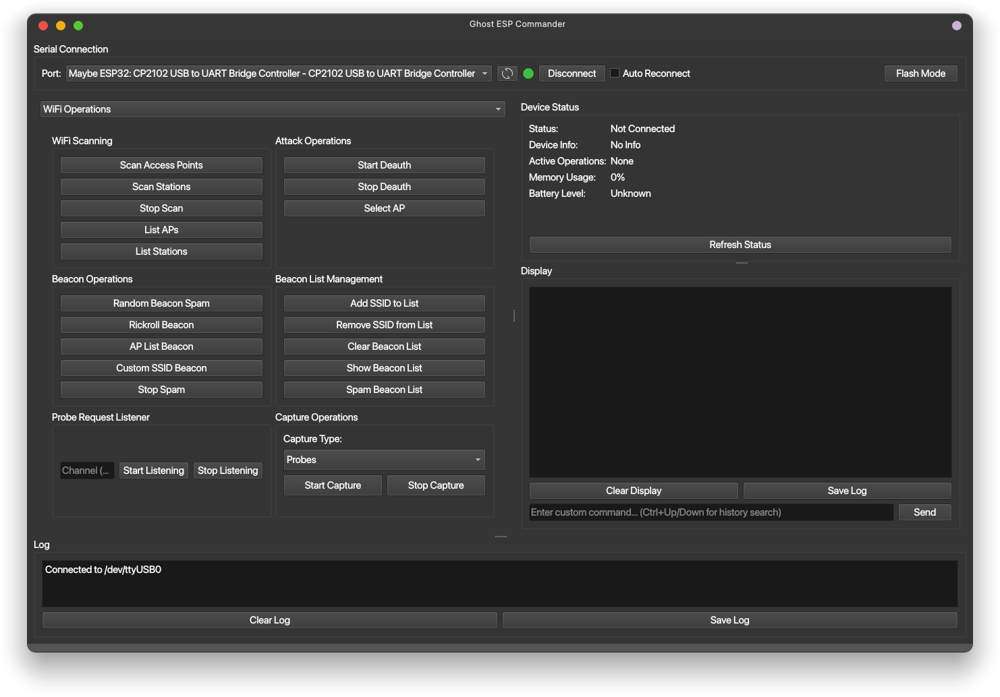

# Ghost ESP Control Panel - README

## Overview

The **Ghost ESP Commander** is a comprehensive GUI application for controlling and communicating with an ESP32 microcontroller over a serial connection. Built with Python and PyQt6, it provides extensive functionality including WiFi/BLE/NFC operations, GPS tracking, SD card management, RGB LED control, infrared remote control, advanced command history, real-time status monitoring, and much more.

## Features

### Core Functionality
- **Serial Connection Management**: Connect/disconnect to ESP32 devices via serial port with auto-reconnect capability.
- **Real-Time Status Dashboard**: Monitor device status, memory usage, battery level, and active operations.
- **Enhanced Command History**: Advanced command history with search, filtering, and management capabilities.
- **Custom Command Support**: Send any command directly with intelligent command completion.

### Network Operations
- **WiFi Operations**: Comprehensive WiFi scanning, AP/station listing, de-auth attacks, beacon spam, and probe monitoring.
- **BLE Operations**: Bluetooth device scanning, Flipper/AirTag detection, and raw BLE packet analysis.
- **Evil Portal Management**: Upload and manage custom HTML portals with progress tracking.
- **Packet Capture**: Capture probes, beacons, deauth packets, WPS data, and Pwnagotchi data.

### Advanced Hardware Control
- **NFC Operations**: Complete MIFARE Classic, NTAG, and NDEF card operations including emulation and dictionary attacks.
- **GPS Operations**: GPS tracking, logging, satellite monitoring, and position reporting with configurable intervals.
- **SD Card Management**: File operations, backup/restore, directory management, and card formatting.
- **RGB LED Control**: Color picker, mode selection (Normal/Rainbow/Stealth/Custom), brightness control, and LED effects.
- **Infrared Control**: IR scanning, device-specific remote controls (TV/Audio/DVD/AC/Projector), and IR learning.

### Development Tools
- **Integrated Firmware Flasher**: Flash official or custom firmware images with progress tracking.
- **Release Bundle Management**: Download and flash official release bundles from GitHub.
- **Custom Build System**: Full ESP-IDF integration with build, clean, and flash capabilities.
- **SDKConfig Management**: Copy, edit, and manage SDKConfig templates with visual status indicators.

### Communication & Control
- **Device Communication**: Serial communication controls, device info, status monitoring, and system commands.
- **Printer Control**: Print text, images, QR codes, and test pages with printer configuration.
- **Media Casting**: YouTube video casting with quality and volume controls.
- **Advanced Capture**: WiFi packet capture with configurable channels and duration.
- **Attack Tools**: DHCP starvation and SAE flood attacks with configuration options.
- **Beacon Control**: Advanced beacon spam with intervals, channels, and list management.

### System Tools
- **System Information**: Chip information, help system, and device status monitoring.
- **System Configuration**: Timezone settings, web authentication toggle, and system parameters.
- **Network Discovery**: PineAP detection for WiFi Pineapple identification.
- **ESP32 Communication**: Peer-to-peer ESP32 communication with discovery, connection, and messaging.

### User Experience
- **Modern UI**: Professional tabbed interface with resizable panels and visual overlays.
- **Theme Support**: Dark/light theme support with customizable appearance.
- **Command History Browser**: Visual command history management with search and filtering.
- **Auto-Detect Features**: Automatic chip type detection and status monitoring.
- **Cross-Platform Support**: Works on Linux, Windows, and macOS.
- **Color Terminal Output**: ANSI color code support for better readability.
- **Automatic Setup**: Virtual environment creation and dependency installation on first run.

## Table of Contents

- [Installation](#installation)
- [Usage](#usage)
  - [Starting the Application](#starting-the-application)
  - [Connecting to ESP32](#connecting-to-esp32)
  - [Firmware Flashing](#firmware-flashing)
  - [Release Bundle Flashing](#release-bundle-flashing)
  - [Custom Build Panel](#custom-build-panel)
  - [Available Operations](#available-operations)
  - [Logging and Display](#logging-and-display)
- [Code Structure](#code-structure)
- [UI](#ui)
- [Troubleshooting](#troubleshooting)

## Installation

### Prerequisites

1. **Python 3.8+**: Install Python 3.8 or later.
2. **System Dependencies**:
   ```bash
   sudo apt update
   sudo apt install libxcb-cursor0
   ```
3. idf.py must be installed and in your path. [See their Manual install instructions](https://docs.espressif.com/projects/esp-idf/en/latest/esp32/get-started/index.html#manual-installation)
4. **Ghost ESP Firmware**: Flash your ESP32 with compatible firmware.

## Usage

### Starting the Application

```bash
python main.py
```

### Connecting to ESP32

1. Select a serial port in the **Serial Connection** section.
2. Click **Refresh Ports** if needed.
3. Click **Connect**.
   - The UI will unlock and overlay will disappear when connected.
   - Status and errors are shown in the log area.

---

### Firmware Flashing

- **Flash Firmware Panel**:  
  1. Select the correct chip type for your board.
  2. Browse and select the `bootloader.bin`, `partition-table.bin`, and `firmware.bin` files.
  3. Select the serial port.
  4. Click **Flash Board** to flash your ESP32.
  5. Use **Exit Flash Mode** to return to the main UI.
  - **Instructions for each panel are shown in the Flasher Output window when you switch panels.**

### Release Bundle Flashing

- **Flash Release Bundle Panel**:  
  1. Select a release version or choose **Custom local .zip** to use your own bundle.
  2. Select the desired asset if multiple are available.
  3. Download the asset or browse for a local `.zip` file.
  4. Select the chip type and serial port.
  5. Click **Flash Bundle** to flash your ESP32.
  6. Use **Exit Flash Mode** to return to the main UI.

### Custom Build Panel

- **Custom Build Panel**:  
  1. (Optional) Copy an SDKConfig template or edit your existing one with the edit SDKConfig button.
  2. Set the target chip and run **Set Target**.
  3. Use **Run Build** to compile your firmware (requires ESP-IDF in PATH).
  4. Use **Run idf.py fullclean** to clean the build folder if needed.
  5. Click **Flash Custom Build** to flash the built firmware from the build folder.
  6. Use **Exit Flash Mode** to return to the main UI.
  - **Status indicators** show if ESP-IDF, sdkconfig, build folder, bootloader, partition table, and firmware are present.
  - **Note:** Use at your own risk. Support will not be provided for unofficial images.

---

### Available Operations

#### WiFi Operations
- **Scanning**: Scan access points, stations, and probe requests.
- **Attack Operations**: Start/stop de-auth attacks on selected APs.
- **Beacon Operations**: Random beacon spam, Rickroll beacons, AP list beacons, custom SSID beacons.
- **Beacon Management**: Add/remove/clear beacon lists, spam beacon lists.

#### BLE Operations
- **Device Discovery**: Scan for BLE devices including Flippers and AirTags.
- **Raw BLE Scanning**: Low-level BLE packet capture and analysis.
- **BLE Advertisement Spam**: Apple device spam, Microsoft Swift Pair, Samsung Galaxy Watch, Google Fast Pair, and random spam modes.
- **BLE Wardriving**: GPS-enabled BLE device tracking and logging.
- **AirTag Management**: List and select discovered AirTags with detailed information.

#### NFC Operations
- **MIFARE Classic**: Scan, read, dump, write, and emulate MIFARE Classic cards.
- **NTAG Operations**: Scan, read, write, format NTAG cards.
- **NDEF Operations**: Read, write, and format NDEF data.
- **Advanced Features**: Dictionary attacks, brute force key attempts, file I/O operations.

#### GPS Operations
- **Position Tracking**: Start/stop GPS, get position, satellite info, and status.
- **GPS Logging**: Configurable logging with custom intervals and file paths.
- **GPS Configuration**: Set baud rate, update rate, and reset GPS module.

#### SD Card Management
- **Card Operations**: Mount/unmount, get info, list files, and check status.
- **File Operations**: Download, upload, delete files, create/remove directories.
- **Backup/Restore**: Backup settings, restore configurations, backup logs.
- **Card Maintenance**: Format SD cards when needed.

#### RGB LED Control
- **Mode Selection**: Normal, Rainbow, Stealth, and Custom RGB modes.
- **Color Control**: Visual color picker with live preview.
- **Brightness Control**: Adjustable brightness slider (0-100%).
- **LED Effects**: Rainbow cycle, color fade, breathing, and flash effects.

#### Infrared Control
- **IR Operations**: Scan, send, receive, and stop IR signals.
- **Device Control**: Pre-configured remotes for TV, Audio, DVD, AC, Projector.
- **Custom Devices**: Support for custom device configurations.
- **IR Learning**: Learn and save IR commands for later use.

#### Packet Capture
- **Capture Types**: Probes, beacons, deauth packets, raw packets, WPS data, Pwnagotchi data.
- **Real-Time Monitoring**: Live packet capture with filtering options.

#### Evil Portal Management
- **Portal Upload**: Upload custom HTML files as evil portals.
- **Progress Tracking**: Visual progress indicators during uploads.
- **Portal Management**: Start/stop portals with custom configurations.

#### Communication & Control
- **Device Communication**: Serial controls, device info, memory usage, battery level, system status, restart/reset.
- **Printer Operations**: Print text, images, QR codes, test pages with printer configuration and settings.
- **Media Casting**: YouTube video casting with URL input, quality selection, volume control, and cast management.
- **Advanced Packet Capture**: Configurable WiFi packet capture with channel selection and duration settings.

#### Attack & Security Tools
- **DHCP Starvation**: Start/stop DHCP starvation attacks with configurable threads and target networks.
- **SAE Flood Attack**: WPA3 SAE handshake flooding with password input and attack controls.
- **Attack Configuration**: Thread settings, target network selection, and attack parameter management.

#### Beacon Control
- **Beacon Operations**: Random, Rickroll, AP list, and custom SSID beacon spam with configuration options.
- **Beacon Settings**: Configurable beacon intervals, channels, and spam list management.
- **Beacon List**: Show/clear beacon lists with visual management interface.

#### System Tools
- **System Information**: Chip information display, help system, and comprehensive status monitoring.
- **System Configuration**: Timezone settings, web authentication controls, and system parameter management.
- **Network Discovery**: PineAP detection for identifying WiFi Pineapples with interface selection.
- **ESP32 Communication**: Peer-to-peer ESP32 communication with discovery, connection, and message sending.

#### Settings & Configuration
- **Display Settings**: RGB modes, display timeout, themes, terminal colors, color inversion, and brightness control.
- **Network Settings**: Web authentication, access point enable/disable, and network configuration.
- **System Settings**: Third-party control, power saving mode, and system management.
- **Settings Management**: Save all current settings to device with automatic command detection.

#### Custom Commands & History
- **Command Entry**: Type any command with intelligent command completion.
- **Command History**: Visual history browser with search and filtering.
- **History Management**: Search, filter, and manage command history.
- **Keyboard Shortcuts**: Enhanced navigation with Ctrl+Up/Down for history search.

### Status Monitoring & Display
- **Real-Time Dashboard**: Device status, memory usage, battery level, and active operations.
- **Log Area**: Shows timestamps and command feedback with color-coded output.
- **Display Area**: Shows scan results, status, and structured responses.
- **Status Indicators**: Visual feedback for all system components and operations.

## Code Structure

- **`SerialMonitorThread`**: Reads serial data in a thread, emits via `data_received`.
- **`PortalFileSenderThread`**: Uploads portal files in a thread, emits progress and completion.
- **`ESP32ControlGUI`**: Main GUI class with comprehensive device control capabilities.
  - **Operation Tabs**: WiFi, BLE, NFC, GPS, SD Card, RGB LED, Infrared, Communication, Printer, Media Casting, Packet Capture, Attack Tools, Beacon Control, System Tools, Evil Portal, Settings.
  - **Status Dashboard**: Real-time device monitoring with memory, battery, and operation status.
  - **Command History**: Advanced history management with search, filtering, and visual browser.
  - **Enhanced UI**: Professional tabbed interface with resizable panels and visual overlays.
  - **Status Indicators**: Shows ESP-IDF, sdkconfig, build, firmware, and system component status.
  - **Panel Instructions**: Context-sensitive help and instructions for all operation panels.
  - **Flash Mode**: Integrated firmware flashing with official releases, custom builds, and progress tracking.
  - **Theme Support**: Customizable dark/light themes with user preferences.
  - **Advanced Controls**: Printer configuration, media casting, packet capture settings, attack parameters, beacon configuration, system tools.

## UI

The Ghost ESP Commander features a modern, professional interface with:

- **Tabbed Operation Panels**: Organized sections for each major functionality
- **Status Dashboard**: Real-time device monitoring at the top
- **Resizable Layout**: Flexible command and display areas
- **Visual Status Indicators**: Color-coded connection and operation status
- **Professional Theming**: Dark theme with customizable appearance



*Main interface showing the comprehensive operation tabs and status dashboard*

## Troubleshooting

### Connection Issues
- **Cannot Connect to ESP32**: Check port permissions, firmware compatibility, and power supply.
- **Unexpected Disconnects**: Verify cable integrity, try lower baud rates, enable auto-reconnect.
- **Port Access Denied**: On Linux, add user to `dialout` group: `sudo usermod -a -G dialout $USER`.

### Command & Operation Issues
- **Command Errors**: Ensure commands match your firmware version and capabilities.
- **Operation Timeouts**: Some operations (NFC, GPS) may take time - monitor status dashboard.
- **Feature Not Available**: Verify your ESP32 hardware supports the requested feature (GPS, NFC, etc.).

### UI & Display Issues
- **UI Overlay Covers Controls**: Overlay only covers main UI; serial controls always accessible.
- **Status Dashboard Not Updating**: Check connection status and refresh manually if needed.
- **Command History Not Working**: Ensure focus is on command entry field for keyboard shortcuts.

### Hardware-Specific Issues
- **NFC Operations Fail**: Check PN532 module connections and power.
- **GPS No Fix**: Ensure GPS antenna has clear sky view and is properly connected.
- **SD Card Issues**: Verify card formatting (FAT32) and proper SPI connections.
- **RGB LED Not Working**: Check LED strip wiring and power supply.
- **IR Not Responding**: Verify IR LED/transmitter is properly connected and aimed.

### Development & Build Issues
- **ESP-IDF Not Found**: Ensure `idf.py` is in your PATH for custom build features.
- **Build Failures**: Check ESP-IDF installation and project configuration.
- **Missing Components**: Use status indicators to diagnose missing files or configurations.
- **Flash Failures**: Verify chip type selection and serial port availability.

### File & Upload Issues
- **Portal Upload Hangs**: Ensure stable connection and sufficient ESP32 memory.
- **File Operations Fail**: Check SD card mounting and file permissions.
- **Large File Transfers**: May require extended timeouts for large files.

### Performance & System
- **High Memory Usage**: Close unused applications during intensive operations.
- **Slow Response**: Some operations (scanning, capture) are CPU-intensive - be patient.
- **Virtual Environment Issues**: Delete `.venv` folder and restart if dependency problems occur.

---

**Important Note**: This application provides extensive control over ESP32 devices and network operations. Use responsibly and comply with local regulations when using network diagnostic and security testing tools. Always ensure you have permission to scan networks and test devices.
